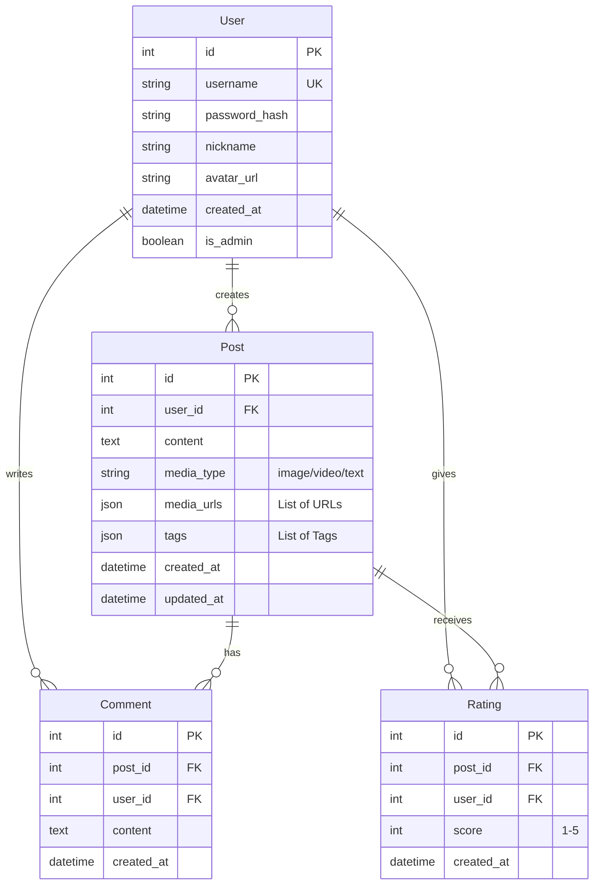

# Multimedia Social Platform ("Moments" Clone) - Project Blueprint

> [!IMPORTANT]
> This document is designed to guide an AI Agent (e.g., GPT-5) to generate the complete codebase for the project. It defines the architecture, data models, and implementation steps in detail.

## 1. Project Overview
A multimedia social platform consisting of a **Mini Program Frontend** for users to share moments (images, videos, text) and a **Web Backend** for administrators to manage content and users.

### Core Features
- **User (Mini Program):**
  - Register/Login (Password based).
  - Post multimedia content (Text, Image, Video).
  - Tagging system for posts.
  - Search posts by date or tags.
  - View, Edit, Delete own posts.
  - Rate (Score) and Comment on others' posts.
  - **Bonus:** Friend system, Sensitive word filtering, LLM content analysis.
- **Admin (Web Dashboard):**
  - User Management (Query, Delete).
  - Content Management (Query, Delete posts/comments).
  - **Bonus:** Statistics Dashboard (User activity, Post frequency).

## 2. Technical Architecture

### Tech Stack
- **Backend:** Python 3.10+ with **FastAPI**. (Chosen for performance and easy AI integration).
- **Database:** **PostgreSQL** (Production) or **SQLite** (Dev). ORM: **SQLAlchemy (Async)**.
- **Admin Frontend:** **Vue 3** + **Vite** + **Element Plus**.
- **Mini Program:** **Uni-app** (Vue 3 based) -> Compiles to WeChat Mini Program.
- **Storage:** Local Filesystem (for simplicity) or MinIO/S3 compatible.

### System Architecture Diagram
```mermaid
graph TD
    User[User (Mini Program)] -->|HTTPS| API[FastAPI Backend]
    Admin[Admin (Web Dashboard)] -->|HTTPS| API
    API -->|Read/Write| DB[(PostgreSQL/SQLite)]
    API -->|Store Media| Storage[File Storage / Object Store]
    API -->|Analyze Content| LLM[LLM Service (Bonus)]
```

## 3. Database Design

### ER Diagram


## 4. API Design (RESTful)

### Auth
- `POST /auth/register`: Register new user.
- `POST /auth/login`: Login, return JWT.
- `GET /auth/me`: Get current user info.

### Users
- `GET /users`: (Admin) List users.
- `DELETE /users/{id}`: (Admin) Delete user.

### Posts
- `POST /posts`: Create post (upload files separately or base64).
- `GET /posts`: List posts (filters: tag, date, user_id).
- `GET /posts/{id}`: Get single post details.
- `PUT /posts/{id}`: Update post.
- `DELETE /posts/{id}`: Delete post.

### Interactions
- `POST /posts/{id}/comments`: Add comment.
- `POST /posts/{id}/rate`: Rate a post.

### Upload
- `POST /upload`: Upload file, return URL.

## 5. Implementation Steps for GPT-5

### Phase 1: Backend Core (FastAPI)
1.  **Setup**: Initialize FastAPI project with `uvicorn`. Configure `SQLAlchemy` for DB connection.
2.  **Models**: Implement User, Post, Comment, Rating, Tag models.
3.  **Auth**: Implement JWT authentication (OAuth2PasswordBearer).
4.  **CRUD**: Implement API endpoints for all resources.
5.  **Upload**: Implement local file upload handler (store in `static/uploads`).

### Phase 2: Admin Dashboard (Vue 3)
1.  **Setup**: `npm create vite@latest admin-web -- --template vue-ts`. Install `element-plus`, `axios`, `vue-router`.
2.  **Login**: Create Admin Login page.
3.  **Layout**: Create Dashboard layout with Sidebar.
4.  **User Mgmt**: Table to list users, button to delete.
5.  **Content Mgmt**: Table to list posts (show thumbnail), button to delete.
6.  **Stats (Bonus)**: Use `ECharts` to show posts per day.

### Phase 3: Mini Program (Uni-app)
1.  **Setup**: Create Uni-app project (Vue 3).
2.  **Pages**:
    - `pages/index/index`: Feed (List of posts).
    - `pages/upload/upload`: Form to pick image/video, enter text, add tags.
    - `pages/profile/profile`: User info, my posts list.
    - `pages/detail/detail`: Post detail, comments, rating.
3.  **Logic**: Connect to FastAPI endpoints using `uni.request`.
4.  **UI**: Use a UI library like `uView` or standard CSS for a clean "Moments" look.

### Phase 4: Bonus Features
1.  **Sensitive Word Filter**: Middleware in FastAPI to check text content against a list ("Sandwich Defense").
2.  **LLM Integration**: Synchronous Proxy Pattern calling OpenRouter deepseek-chat, with local Caching to reduce costs.

## 6. Directory Structure
```
/project-root
  /backend
    /app
      /models
      /routers
      /core (config, security)
      main.py
    /static (uploads)
    requirements.txt
  /admin-web (Vue 3)
  /mini-program (Uni-app)
  docker-compose.yml (Optional)
```
