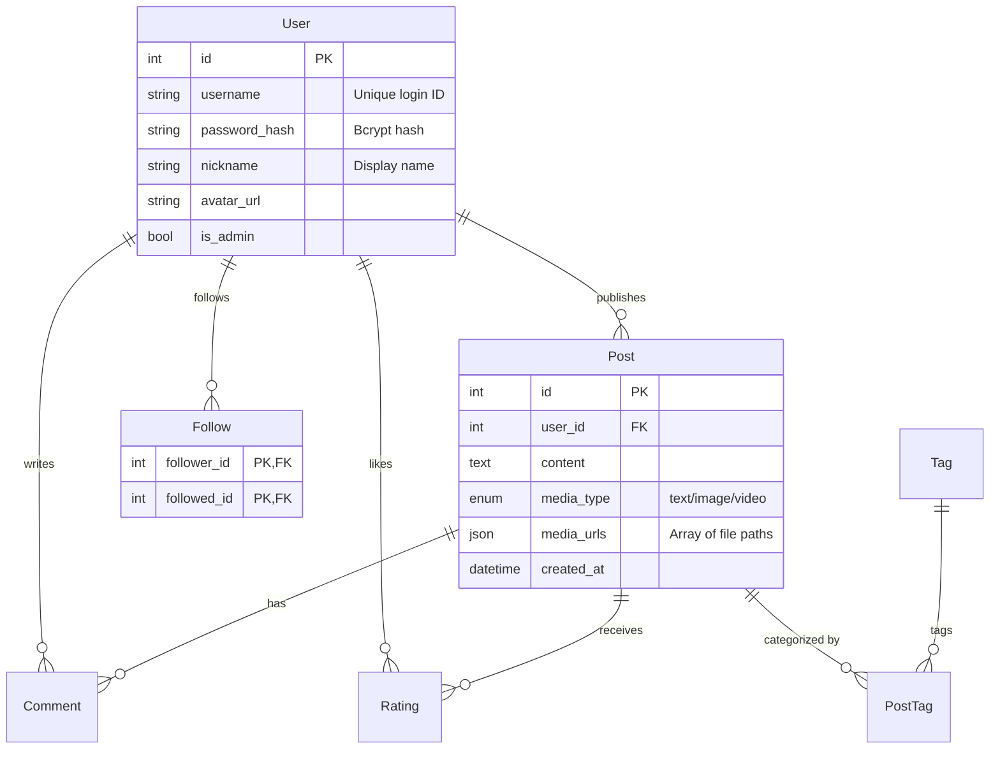
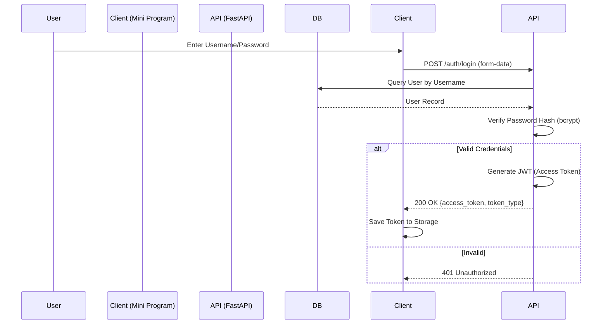
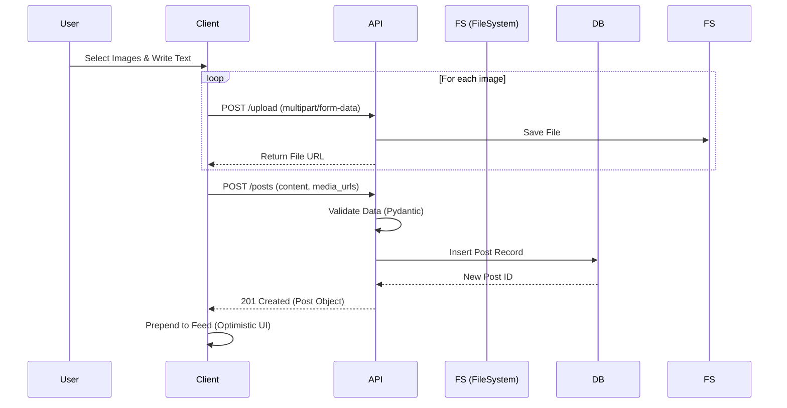
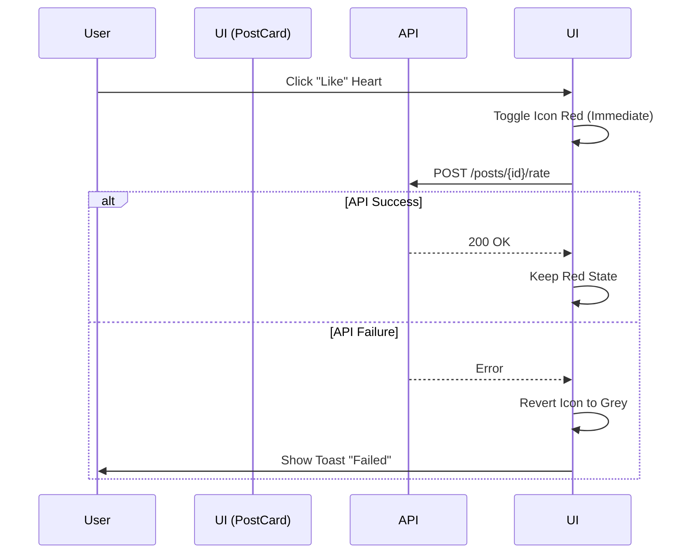

# System Architecture & Technical Design Document

**Project Name**: Multimedia Social Platform ("Moments" Clone)
**Version**: 1.0.0
**Last Updated**: 2025-12-03

---

## 1. Executive Summary

This document provides a comprehensive technical overview of the Multimedia Social Platform. The system is a full-stack social media application designed to replicate core functionalities of WeChat Moments, including multimedia posting (text, image, video), social interactions (likes, comments, follows), and a robust administrative dashboard.

The architecture follows a **Modern Separation of Concerns** principle, utilizing a headless Python backend (FastAPI) serving two distinct frontends: a mobile-first Mini Program (Uni-app) and a desktop Admin Dashboard (Vue 3).

---

## 2. Technology Stack

### 2.1 Backend (Server-Side)
*   **Language**: Python 3.9+
*   **Framework**: **FastAPI** (High-performance ASGI framework)
*   **Database**: **SQLite** (Development) / **PostgreSQL** (Production ready)
*   **ORM**: **SQLAlchemy** (AsyncIO support)
*   **Authentication**: OAuth2 with Password Flow + **JWT** (JSON Web Tokens)
*   **Validation**: **Pydantic V2** (Data serialization and validation)
*   **Security**: `Passlib` (Bcrypt hashing), `Python-Multipart` (File uploads)

### 2.2 Admin Frontend (Web Client)
*   **Framework**: **Vue.js 3** (Composition API)
*   **Build Tool**: **Vite** (Next-generation frontend tooling)
*   **UI Library**: **Element Plus** (Enterprise-grade UI components)
*   **HTTP Client**: **Axios** (with interceptors for token management)
*   **Visualization**: **ECharts** (Data visualization)
*   **Language**: TypeScript / JavaScript

### 2.3 Mobile Client (Mini Program)
*   **Framework**: **Uni-app** (Vue 3 based cross-platform framework)
*   **Target Platform**: WeChat Mini Program / H5 Mobile Web
*   **Styling**: Scoped CSS, Flexbox layout
*   **Network**: `uni.request` wrapper with Promise support

---

## 3. System Architecture

### 3.1 High-Level Architecture Diagram

```mermaid
graph TD
    subgraph "Client Layer"
        MP[Mobile Client (Uni-app)]
        Web[Admin Dashboard (Vue 3)]
    end

    subgraph "Gateway Layer"
        Nginx[Nginx / Reverse Proxy]
    end

    subgraph "Application Layer (FastAPI)"
        API[Main API Service]
        Auth[Auth Middleware]
        Static[Static File Server]
    end

    subgraph "Data Persistence Layer"
        DB[(Primary Database)]
        FS[File System / Object Storage]
    end

    MP -->|HTTPS / JSON| Nginx
    Web -->|HTTPS / JSON| Nginx
    Nginx --> API
    API --> Auth
    API --> Static
    API --> DB
    Static --> FS
```

### 3.2 Directory Structure & Modules

#### Backend (`/backend`)
| Directory | Responsibility |
| :--- | :--- |
| `app/core` | **Core Infrastructure**: Database connection (`database.py`), Security (`security.py`), Config (`config.py`). |
| `app/models` | **Data Access Layer**: SQLAlchemy models defining DB schema (`user.py`, `post.py`, etc.). |
| `app/schemas` | **Data Transfer Objects (DTOs)**: Pydantic models for request/response validation. |
| `app/routers` | **Controllers**: API endpoints handling HTTP requests (`auth.py`, `posts.py`, `users.py`). |
| `static/uploads` | **Storage**: Local directory for uploaded images/videos. |

#### Admin Web (`/admin-web`)
| Directory | Responsibility |
| :--- | :--- |
| `src/views` | **Pages**: `Login.vue`, `Dashboard.vue`, `Users.vue`, `Posts.vue`. |
| `src/layout` | **Layouts**: Main application shell (Sidebar, Header). |
| `src/api.ts` | **Networking**: Centralized Axios instance with JWT injection. |

#### Mini Program (`/mini-program`)
| Directory | Responsibility |
| :--- | :--- |
| `pages/` | **Screens**: `index` (Feed), `upload` (Post), `profile` (User), `login`. |
| `components/` | **Widgets**: `PostCard.vue` (Feed Item), `MediaGrid.vue` (Image Grid). |

---

## 4. Database Design

The system uses a relational database model designed for data integrity and efficient querying.

### 4.1 Entity-Relationship (ER) Diagram



### 4.2 Key Schema Decisions
1.  **Media Storage**: Instead of a separate `Media` table, we use a `JSON` column (`media_urls`) in the `Post` table. This simplifies queries for posts that have multiple images (1-9 images), typical for "Moments" style feeds.
2.  **Interactions**: `Rating` table is used for "Likes". It stores a `score` (1-5), but for the "Like" feature, we standardize on a score of 5. This allows future extensibility to a star-rating system without schema changes.
3.  **Follow System**: Implemented as a self-referential many-to-many relationship on the `User` table using a dedicated association table (`follows`).

---

## 5. Core Business Flows

### 5.1 User Login & Token Issue
This flow demonstrates the OAuth2 Password Bearer pattern.



### 5.2 Posting Multimedia Content
This flow handles file uploads and post creation.



### 5.3 Optimistic Interaction (Like/Unlike)
To ensure a smooth user experience, the UI updates immediately.



---

## 6. Security Implementation

### 6.1 Authentication
*   **JWT (JSON Web Tokens)**: Stateless authentication. The server does not store session data. The token contains the `sub` (username) and expiration time.
*   **Algorithm**: HS256 (HMAC with SHA-256).
*   **Expiration**: Tokens are valid for 30 minutes (configurable).

### 6.2 Password Security
*   **Hashing**: Uses `bcrypt` (via `passlib`). Bcrypt is slow by design to resist brute-force attacks.
*   **Salting**: Automatic salting handling by the library.

### 6.3 API Security
*   **Dependency Injection**: FastAPI's `Depends` system is used to inject the `get_current_user` dependency into protected routes.
*   **CORS**: Configured to allow requests from `localhost` (dev) or specific domains (prod) to prevent unauthorized cross-origin access.

---

## 7. Frontend Architecture Highlights

### 7.1 Component Design (Vue 3)
*   **Composition API**: Logic is reused using `<script setup>`.
*   **Props & Emits**: Strict data flow. Parent passes data down via `props` (e.g., `Post` object), Child notifies parent via `emits` (e.g., `@delete`, `@like`).
*   **Scoped CSS**: Styles are encapsulated within components to prevent leakage.

### 7.2 State Management
*   **Local State**: `ref` and `reactive` are used for component-local state (e.g., `isLiked`, `commentText`).
*   **Global State**: Simple state sharing via `uni.getStorageSync` for the Auth Token.

---

## 8. Deployment Strategy

### 8.1 Dockerization (Optional)
A `docker-compose.yml` is provided to orchestrate the services:
*   **Service 1 (Backend)**: Python container running `uvicorn`.
*   **Service 2 (DB)**: PostgreSQL container (for production persistence).
*   **Service 3 (Adminer)**: Database management GUI.

### 8.2 Production Considerations
*   **Reverse Proxy**: Use Nginx to handle SSL termination and route requests (`/api` -> Backend, `/` -> Static Frontend).
*   **Process Manager**: Use `gunicorn` with `uvicorn` workers for better concurrency in production.
*   **Static Files**: Serve frontend assets via Nginx/CDN, not the API server.

---

## 9. Future Roadmap
*   **Real-time**: Implement WebSockets for instant notification of likes/comments.
*   **Search**: Integrate Elasticsearch for full-text search of post content.
*   **AI**: Add background workers (Celery) to process images (NSFW check) and generate text summaries.
