# Project Technical Report: "Moments" Social Platform (Detailed)

## 1. Executive Summary
**Moments** is a cloud-native social media platform architected to integrate Generative AI into the daily social loop. It addresses the challenge of "information overload" in modern feeds by providing AI-driven summarization and semantic analysis, while simultaneously lowering the barrier for content creation through generative writing tools.

## 2. System Analysis & Design

### 2.1 Use Case Analysis
The system serves three primary actors:
1.  **Consumer**: Browses feeds, interacts (Like/Comment), uses AI to summarize/translate content.
2.  **Creator**: Publishes multimedia posts, uses AI to polish text/generate titles.
3.  **Administrator**: Moderates content, manages user access, views platform analytics.

### 2.2 Core Business Process Logic (Sequence Diagrams)

#### 2.2.1 AI Assistant Interaction Flow
This diagram illustrates the asynchronous communication between the Client, Backend, Cache, and the External LLM Service.

## 3. Detailed Architecture

### 3.1 Backend: FastAPI Micro-Monolith
- **ASGI**: Uses `uvicorn` as the ASGI server for high-throughput non-blocking I/O.
- **Dependency Injection**: Heavy use of `Depends()` for database sessions and User context (`current_user`).
- **Pydantic V2**: Uses Rust-based Pydantic for ultra-fast data validation and serialization.

### 3.2 Frontend: UniApp Cross-Platform Engine
- **Runtime**: Runs primarily in the WeChat Mini Program Webview container.
- **Rendering**: Uses Vue 3 Virtual DOM diffing.
- **Network**: Custom `luch-request` style interceptor pattern handling:
    - Token Injection (`Authorization: Bearer ...`).
    - 401 Silent Refresh (Planned).
    - Global Error Toasting.

## 4. Database Schema Specification (PostgreSQL)

### 4.1 ER Diagram

```mermaid
erDiagram
    Users ||--o{ Posts : "authors"
    Users ||--o{ Comments : "writes"
    Users ||--o{ Likes : "toggles"
    Posts ||--o{ Comments : "contains"
    Posts ||--o{ PostTags : "tagged"
    Tags ||--o{ PostTags : "categorizes"
    
    Users {
        int id PK
        string username "Unique Index"
        string password_hash "Bcrypt"
        boolean is_admin
    }
    
    Posts {
        int id PK
        int user_id FK
        text content
        jsonb media_urls "Array of Strings"
        enum media_type "'text'|'image'"
    }
```

## 5. Non-Functional Requirements (NFRs) Deep Dive

### 5.1 Latency Budget
- **API Overhead**: < 20ms (FastAPI serialization).
- **Database Query**: < 50ms (Indexed, excluding complex joins).
- **Network RTT**: ~100ms (Mobile networks).
- **Total Standard Request Target**: < **200ms**.

### 5.2 Scalability Strategy
- **Horizontal**: The API tier is stateless. We can deploy `N` replicas behind an Nginx Load Balancer.
- **Vertical**: The Database is the bottleneck. Mitigation strategies:
    - **Read Replicas**: For Feed queries (Read Heavy).
    - **Caching**: Redis for "Hot" posts.

## 6. Deployment & DevOps
- **Containerization**:
    - **Backend**: Python 3.10-slim image. Multi-stage build to reduce image size (< 200MB).
    - **Frontend**: Built via `npm run build:mp-weixin` -> CI uploads to WeChat.
- **Orchestration**: Docker Compose (Dev) / K8s (Prod).

## 7. Future Work
1.  **Vector Database (pgvector)**: Store embeddings of Post Content for semantic retrieval.
2.  **WebSocket (Socket.IO)**: For real-time "User X liked your post" notifications.
